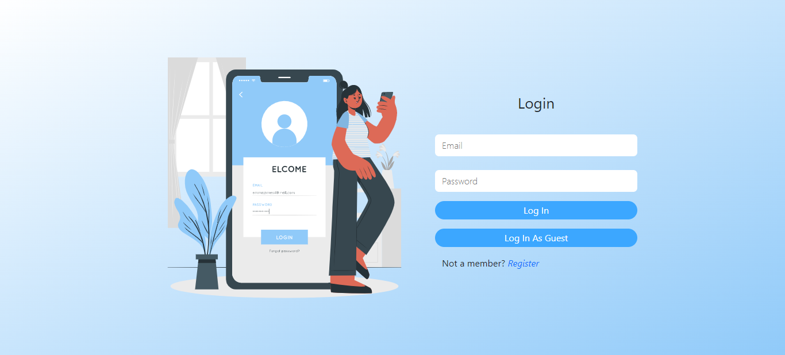
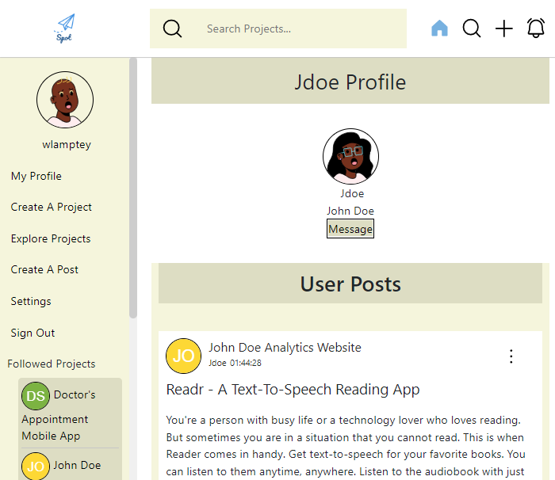
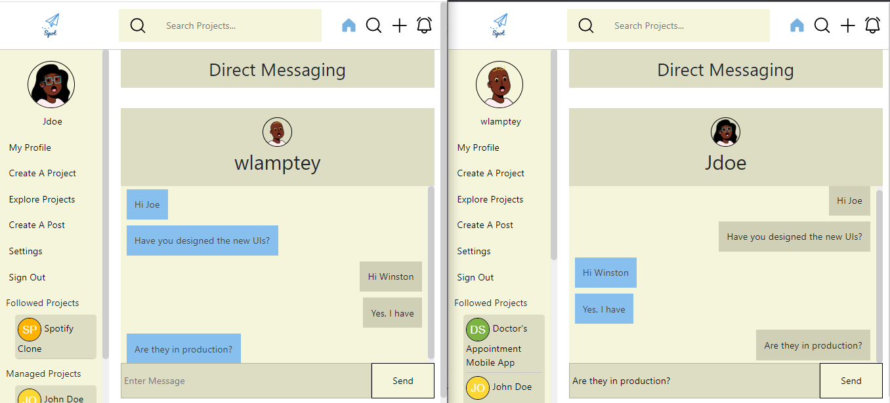
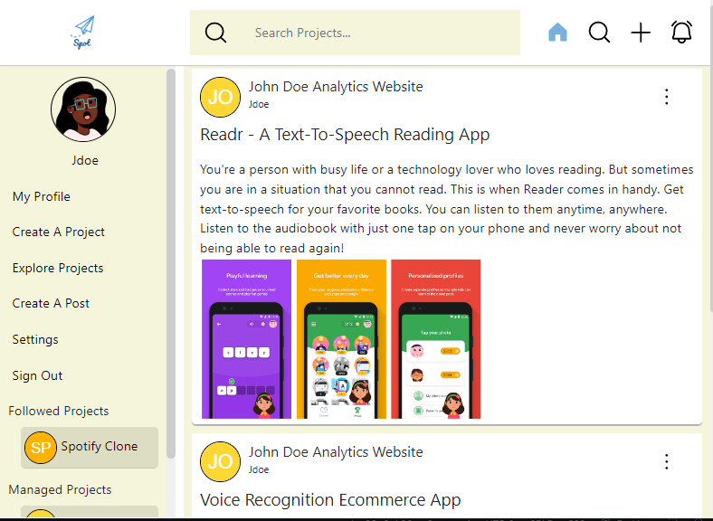
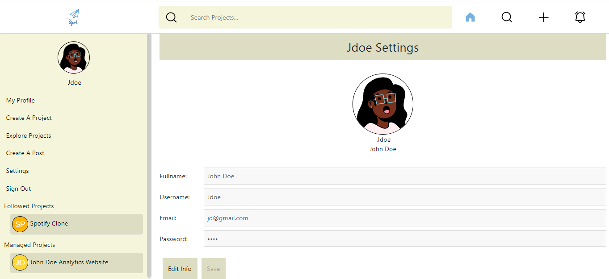
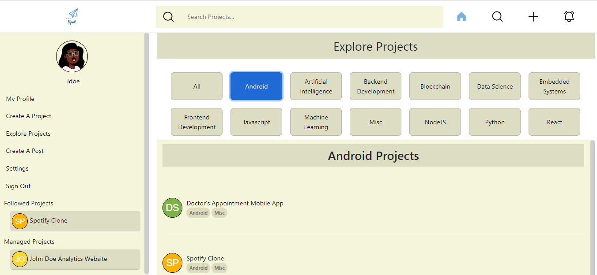
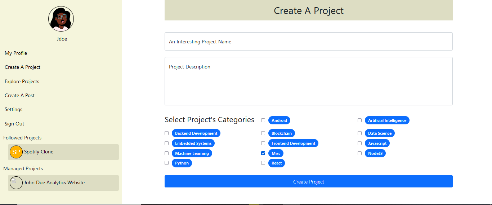
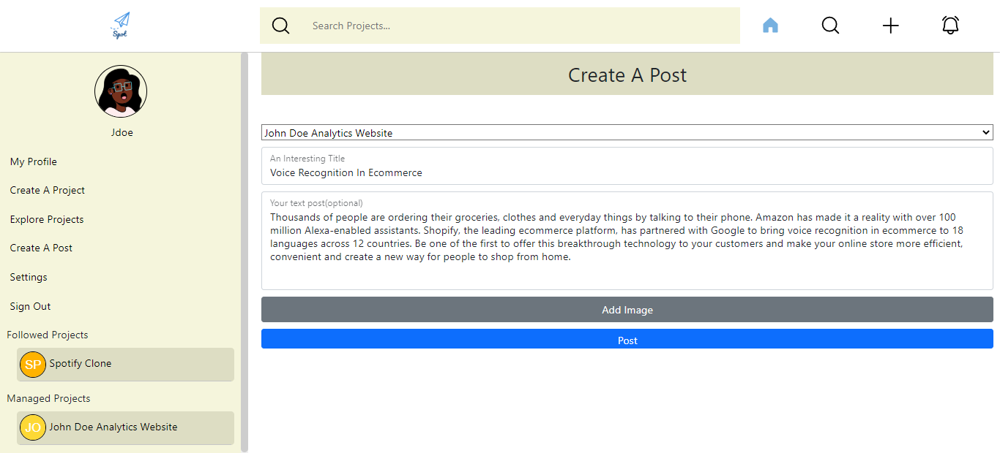

# Spot-Project
A social media web app

- [Spot-Project](#spot-project)
    - [Snapshots of Application](#snapshots-of-application)
    - [Installation Steps](#installation-steps)

### Snapshots of Application

***login-page***

***user-profile***

***direct-messaging***

***user-home-feed***

***user-settings***

***explore-projects***

***create-a-project***

***create-a-post***

### Installation Steps
1. Install NodeJs On Your Computer

2. Open the Command Line Terminal(or equivalent) on your computer

3. Navigate to the project folder.

4. Once in the project folder, run the command "npm install".

This will download and install all the dependecies necessary to run the application on your device.

5. Once the command completes execution, open another command line terminal and navigate to your project folder.
At this point, you should have two terminals open.

6. In the first terminal, run the command "npm run nodemon"
This will start up the Main Server

7. In the second terminal, run the command "npx nodemon .\controllers\private-messaging\server-socket.js"
This will start up the Messaging Server.

8. Open a browser, Chrome Browser is preferred.

9. Open the URL "http://localhost:3002"

10. You should now be able to interact with the application's interface. 

You can reach me at winstonlamptey456@gmail.com, if you have any questions or encounter any unexpected error